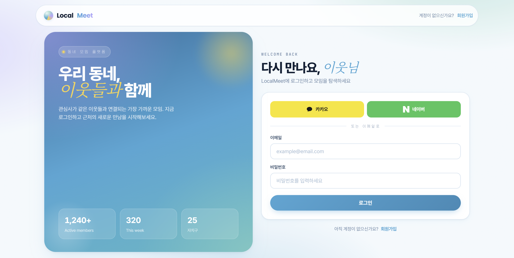
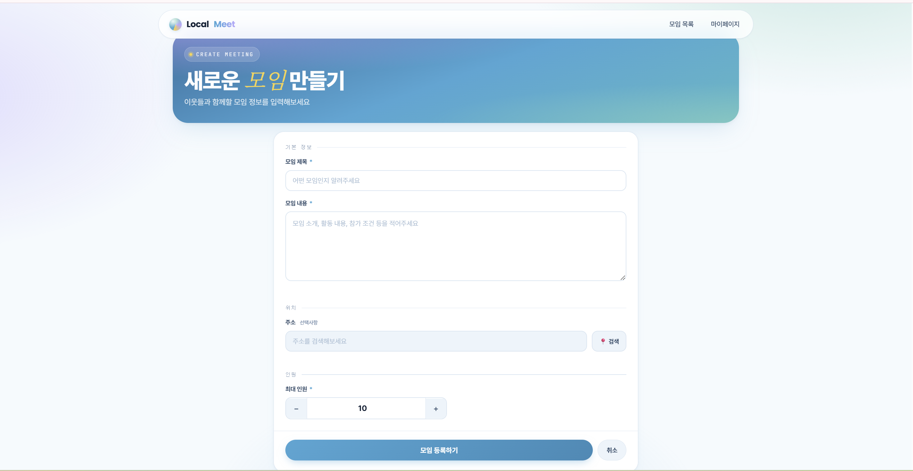
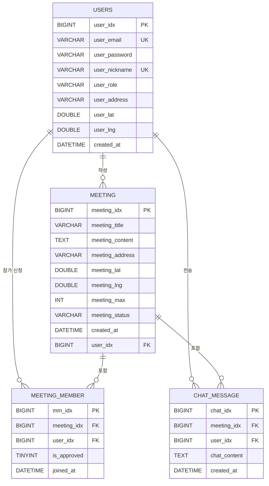

# 🗺️ LocalMeet - 위치 기반 동네 모임 커뮤니티

## 📌 프로젝트 소개

🏷 **프로젝트 명 : LocalMeet**

🗓️ **프로젝트 기간 : 2026.03 ~ 2026.04**

👤 **구성원 : 김태혁 (개인 프로젝트)**

---

### ✅ 배포 주소

http://13.209.110.13:8080

### ✅ 기획 배경

> "같은 동네 사람들끼리 쉽게 만날 수 있다면?"

동네 모임을 만들고 싶어도 적당한 플랫폼이 없어 불편했던 경험에서 출발했습니다.  
위치 기반으로 내 주변의 모임을 탐색하고, 신청부터 채팅까지 한 곳에서 해결할 수 있는 서비스를 직접 구현해보고자 했습니다.  
또한 JWT 인증, WebSocket, SSE, OAuth2 등 실무에서 많이 사용되는 기술을 실제로 통합 구현하는 것을 목표로 삼았습니다.

---

### ✅ 서비스 소개

> 위치 기반으로 동네 모임을 개설하고, 참가 신청부터 실시간 채팅까지 지원하는 커뮤니티 플랫폼

- 카카오맵 기반으로 내 동네에서 열리는 모임을 탐색하고 참가 신청할 수 있다.
- 모임장은 참가 신청을 승인/거절하고, 모임 상태를 관리할 수 있다.
- 모임별 실시간 채팅과 SSE 알림으로 참가자들이 즉각적으로 소통할 수 있다.
- 카카오, 구글 소셜 로그인을 지원한다.

---

### 👥 서비스 대상

- 같은 관심사를 가진 동네 사람들과 모임을 만들고 싶은 사람들
- 기존 SNS가 아닌 목적 중심의 소규모 오프라인 모임을 원하는 사람들

---

## 🛠 기술 스택

### Backend
<p>
  
  
  
  
  
  
  
  
  
</p>

### Frontend
<p>
  
  
  
  
  
</p>

### Database & Build & Deploy
<p>
  
  
  
</p>

---

## 💌 서비스 화면 및 기능 소개

### ✅ 메인 (모임 목록)

- **모임 목록 및 지도 조회**
> 카카오맵에 모임 위치를 마커로 표시하고, 동네 키워드로 검색할 수 있다.


---

### ✅ 회원

- **회원가입**
> 이메일, 비밀번호, 닉네임으로 회원가입할 수 있다. 이메일·닉네임 실시간 중복 확인을 지원한다.


- **로그인 / 소셜 로그인**
> 이메일/비밀번호 로그인 및 카카오·구글 OAuth2 소셜 로그인을 지원한다.



- **마이페이지**
> 내 정보(닉네임, 이메일, 동네)를 확인할 수 있다.


---

### ✅ 모임

- **모임 생성**
> 카카오 주소 검색 API로 모임 장소를 선택하고, 제목·내용·최대 인원을 입력해 모임을 개설할 수 있다.



- **모임 상세 조회 및 참가 신청**
> 모임 상세 정보와 카카오맵 위치를 함께 확인하고, 참가 신청 버튼으로 바로 신청할 수 있다.


- **모임 수정/삭제**
> 모임 작성자만 수정·삭제 버튼이 표시되며, 수정 폼에서 내용을 변경할 수 있다.


---

### ✅ 참가 신청 및 승인

- **참가 신청 / 승인**
> 신청자는 모임 상세 페이지에서 참가 신청을 할 수 있고, 모임장은 신청자 목록에서 승인/거절할 수 있다.  
> 승인 인원이 최대 인원에 도달하면 모임 상태가 자동으로 `모집완료`로 변경된다.

> `대기중 → 승인 / 거절`


---

### ✅ 실시간 채팅

- **WebSocket 모임 채팅**
> 모임 상세 페이지 하단에 실시간 채팅창이 내장되어 있다.  
> WebSocket(STOMP) 기반으로 메시지를 주고받고, 입장 시 이전 채팅 내역이 자동으로 로드된다.


---

### ✅ 실시간 알림

- **SSE 알림**
> 누군가 내 모임에 참가 신청을 하면 모임장에게 실시간 알림이 전송된다.


---

### ✅ 관리자 페이지

- **회원 / 모임 관리**
> 전체 회원 목록 조회 및 강제 탈퇴, 전체 모임 조회·삭제·상태 변경을 할 수 있다.


---

## 📡 API 명세서

| Method | URL | 설명 | 인증 |
|--------|-----|------|------|
| POST | `/api/auth/signup` | 회원가입 | ❌ |
| POST | `/api/auth/login` | 로그인 (JWT 발급) | ❌ |
| GET | `/api/auth/mypage` | 내 정보 조회 | ✅ |
| GET | `/api/auth/check-email` | 이메일 중복 확인 | ❌ |
| GET | `/api/auth/check-nickname` | 닉네임 중복 확인 | ❌ |
| GET | `/api/meetings` | 모임 전체 목록 | ❌ |
| POST | `/api/meetings` | 모임 등록 | ✅ |
| GET | `/api/meetings/{id}` | 모임 상세 조회 | ❌ |
| POST | `/api/meetings/{id}/update` | 모임 수정 | ✅ |
| GET | `/api/meetings/{id}/delete` | 모임 삭제 | ✅ |
| POST | `/api/meetings/{id}/join` | 참가 신청 | ✅ |
| POST | `/api/meetings/approve/{mmIdx}` | 참가 승인 | ✅ |
| GET | `/api/meetings/search?keyword=` | 동네 키워드 검색 | ❌ |
| GET | `/api/chat/{meetingIdx}` | 채팅 내역 조회 | ❌ |
| WS | `/ws/chat` | WebSocket 채팅 연결 | JWT 헤더 |
| GET | `/api/notifications/subscribe` | SSE 알림 구독 | ✅ |
| GET | `/api/admin/users` | 회원 전체 조회 (관리자) | ✅ |
| DELETE | `/api/admin/users/{id}` | 회원 강제 탈퇴 (관리자) | ✅ |
| GET | `/api/admin/meetings` | 모임 전체 조회 (관리자) | ✅ |
| DELETE | `/api/admin/meetings/{id}` | 모임 삭제 (관리자) | ✅ |
| POST | `/api/admin/meetings/{id}/status` | 모임 상태 변경 (관리자) | ✅ |

---

## 🏗 시스템 아키텍처

```
[Thymeleaf + Vanilla JS]
         │
         │  REST API (JWT 헤더 포함)
         ▼
[Spring Boot 3.4.3]
         │
 ┌───────┼───────────────┐
 │       │               │
[Spring Security]  [WebSocket/STOMP]  [SSE]
[JWT Filter]       [채팅 브로드캐스트]  [알림 전송]
[OAuth2 Handler]
         │
  [Spring Data JPA + QueryDSL]
         │
     [MySQL 8]
```

---

## 🗂 프로젝트 구조

```
src/main/java/com/study/localmeet/
├── config/                           # 설정 클래스
│   ├── SecurityConfig.java           # Spring Security 설정 (JWT, OAuth2, CORS)
│   ├── JwtUtil.java                  # JWT 토큰 생성 / 검증
│   ├── JwtAuthenticationFilter.java  # JWT 인증 필터
│   ├── OAuth2SuccessHandler.java     # OAuth2 로그인 성공 후 JWT 발급
│   ├── CustomUserDetailsService.java # 이메일 기반 UserDetails 로드
│   ├── WebSocketConfig.java          # STOMP + SockJS WebSocket 설정
│   └── QueryDslConfig.java           # QueryDSL JPAQueryFactory 빈 등록
│
├── controller/                       # 컨트롤러
│   ├── AuthController.java           # 회원가입 / 로그인 / 마이페이지
│   ├── MeetingController.java        # 모임 CRUD / 참가 신청·승인
│   ├── ChatController.java           # WebSocket 채팅 메시지 수신·브로드캐스트
│   ├── NotificationController.java   # SSE 알림 구독
│   ├── AdminController.java          # 관리자 (회원·모임 관리)
│   └── ViewController.java           # 뷰 라우팅
│
├── domain/                           # 엔티티 & 레포지토리
│   ├── user/
│   │   ├── Users.java
│   │   └── UsersRepository.java
│   ├── meeting/
│   │   ├── Meeting.java
│   │   └── MeetingRepository.java
│   ├── meetingmember/
│   │   ├── MeetingMember.java
│   │   └── MeetingMemberRepository.java
│   └── chat/
│       ├── ChatMessage.java
│       └── ChatMessageRepository.java
│
├── dto/                              # DTO
│   ├── auth/
│   ├── meeting/
│   └── chat/
│
├── enumeration/                      # 열거형
│   ├── UserRole.java                 # ROLE_USER, ROLE_ADMIN
│   └── MeetingStatus.java            # OPEN, FULL, CLOSED
│
└── service/                          # 서비스 (비즈니스 로직)
    ├── AuthService.java
    ├── MeetingService.java
    ├── ChatService.java
    ├── NotificationService.java
    ├── AdminService.java
    └── CustomOAuth2UserService.java

src/main/resources/
├── templates/
│   ├── auth/                         # 로그인 / 회원가입 / 마이페이지
│   ├── meeting/                      # 모임 목록 / 상세 / 등록 / 수정
│   └── admin/                        # 관리자 페이지
├── static/css/style.css
├── application.properties
└── db.sql
```

---

## 📜 프로젝트 산출물

### ERD



---

## 💡 구현 포인트

**JWT Stateless 인증**  
세션을 사용하지 않고 매 요청마다 헤더의 JWT 토큰을 검증하는 Stateless 방식으로 구현했습니다.  
`JwtAuthenticationFilter`에서 토큰 유효성 검사 후 `SecurityContext`에 인증 정보를 저장합니다.

**WebSocket 채팅 보안**  
일반 HTTP 요청과 달리 WebSocket은 Spring Security 필터를 거치지 않기 때문에, STOMP 헤더에 JWT 토큰을 직접 담아 `ChatController`에서 검증하는 방식으로 인증을 처리했습니다.

**OAuth2 소셜 로그인 + JWT 연동**  
소셜 로그인 성공 후 `OAuth2SuccessHandler`에서 JWT 토큰을 발급하고, 쿼리 파라미터로 프론트에 전달하여 `localStorage`에 저장하는 방식으로 JWT 기반 인증과 연동했습니다.

**SSE 실시간 알림**  
서버에서 클라이언트로 단방향 데이터를 전송하는 SSE를 활용해, 참가 신청 이벤트 발생 시 모임장에게 실시간 알림을 전송합니다. `ConcurrentHashMap`으로 활성 연결을 관리하고, 연결 종료·타임아웃 시 자동으로 정리합니다.

**모임 상태 자동 전환**  
참가 승인 시 승인 인원이 최대 인원에 도달하면 모임 상태가 `OPEN → FULL`로 자동 변경되어 추가 신청을 막습니다.

---

## ⚙️ 실행 방법

### 1. MySQL 데이터베이스 생성
```sql
CREATE DATABASE localmeet CHARACTER SET utf8mb4 COLLATE utf8mb4_unicode_ci;
```

### 2. application.properties 환경 변수 설정
```properties
spring.datasource.username=root
spring.datasource.password=본인_비밀번호

jwt.secretKey=임의의_시크릿_키

kakao.map.api-key=카카오_JavaScript_키

spring.security.oauth2.client.registration.kakao.client-id=카카오_REST_API_키
spring.security.oauth2.client.registration.kakao.client-secret=카카오_Client_Secret

spring.security.oauth2.client.registration.google.client-id=구글_클라이언트_ID
spring.security.oauth2.client.registration.google.client-secret=구글_클라이언트_시크릿
```

### 3. 빌드 및 실행
```bash
./gradlew bootRun
```

### 4. 접속
```
http://localhost:8080
```

---

## 🔑 테스트 계정

| 이메일 | 비밀번호 | 권한 |
|--------|---------|------|
| admin@test.com | 1234 | ROLE_ADMIN |
| user@test.com | 1234 | ROLE_USER |

---

## 💙 개발자

| 김태혁 |
|--------|
| Back-End / Front-End |
| 전체 설계 및 구현 |
| JWT 인증 / OAuth2 소셜 로그인 |
| 모임 CRUD / 참가 신청·승인 |
| WebSocket 실시간 채팅 |
| SSE 실시간 알림 |
| 카카오맵 API 연동 |
| 관리자 페이지 |
| AWS EC2 배포 |
