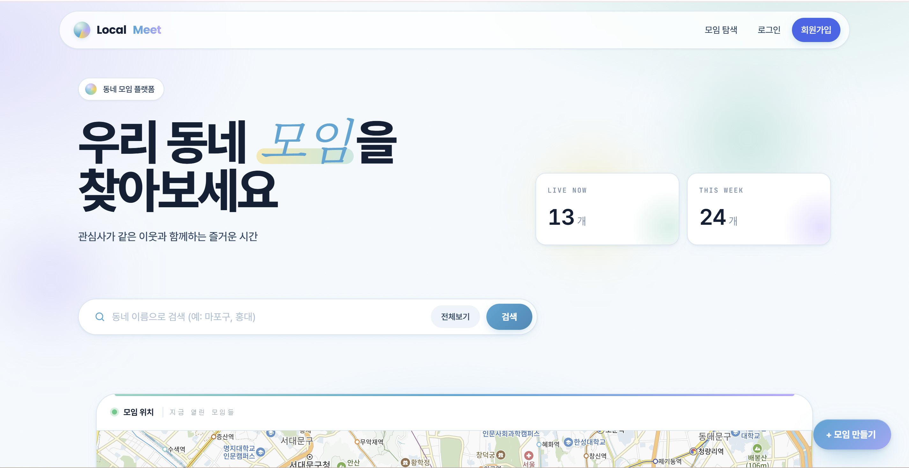
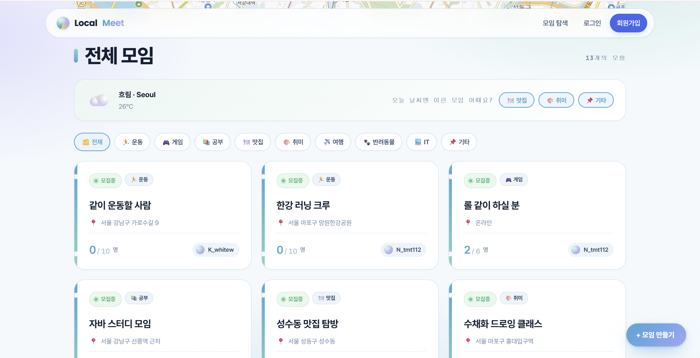
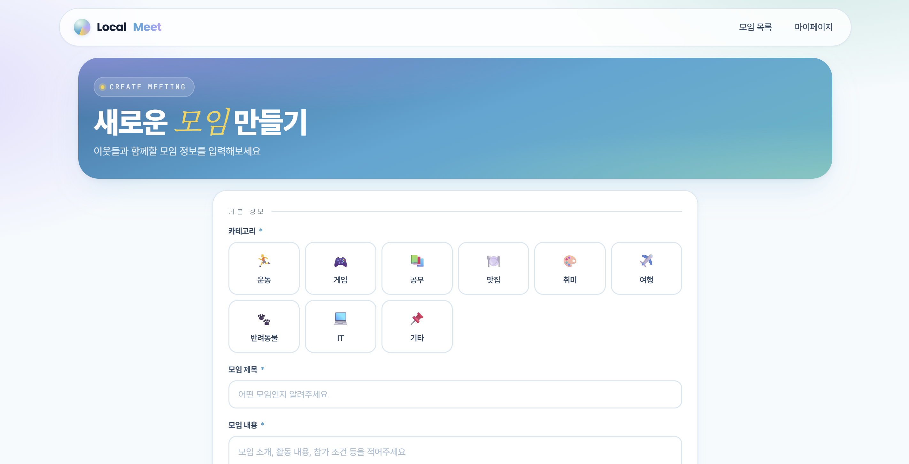
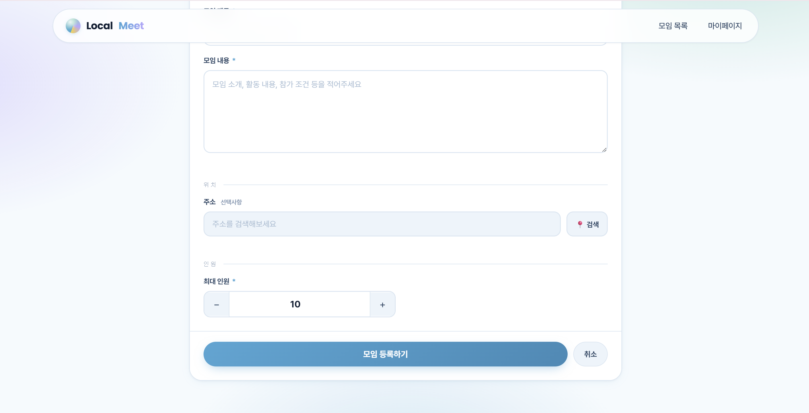
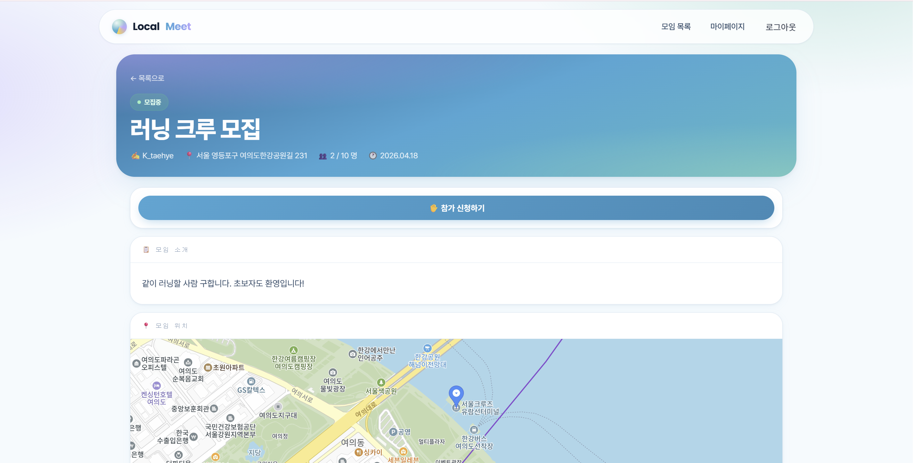
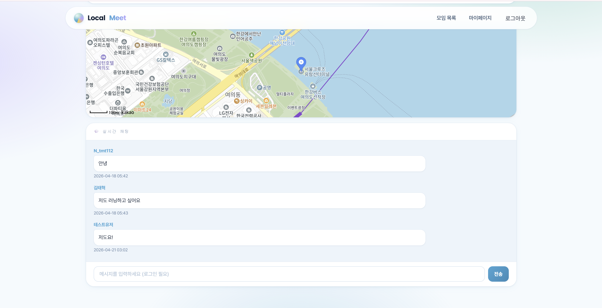
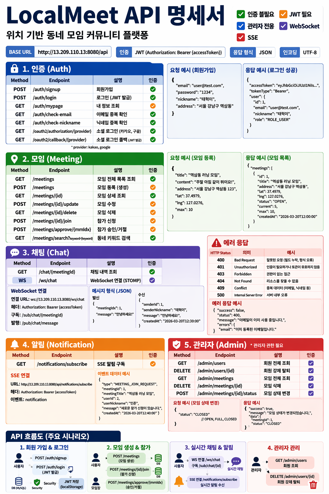
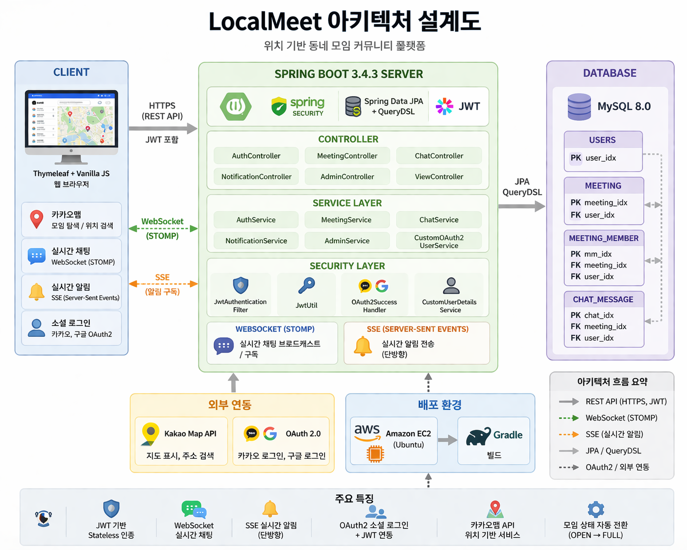
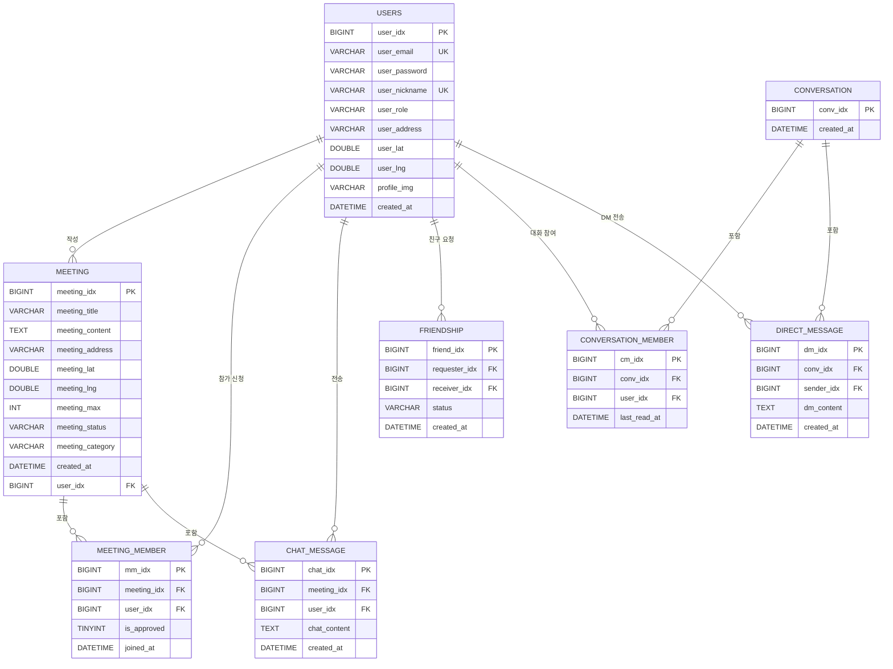

# 🗺️ LocalMeet - 위치 기반 동네 모임 커뮤니티

## 📌 프로젝트 소개

🏷 **프로젝트 명 : LocalMeet**

🗓️ **프로젝트 기간 : 2026.02 ~ 2026.04**

👤 **구성원 : 김태혁 (개인 프로젝트)**

---

### ✅ 배포 주소

https://localmeet.co.kr

### ✅ 기획 배경

> "같은 동네 사람들끼리 쉽게 만날 수 있다면?"

동네 모임을 만들고 싶어도 적당한 플랫폼이 없어 불편했던 경험에서 출발했습니다.  
위치 기반으로 내 주변의 모임을 탐색하고, 신청부터 채팅까지 한 곳에서 해결할 수 있는 서비스를 직접 구현해보고자 했습니다.  
또한 JWT 인증, WebSocket, SSE, OAuth2 등 실무에서 많이 사용되는 기술을 실제로 통합 구현하는 것을 목표로 삼았습니다.

---

### ✅ 서비스 소개

> 위치 기반으로 동네 모임을 개설하고, 참가 신청부터 실시간 채팅까지 지원하는 커뮤니티 플랫폼

- 카카오맵 기반으로 내 동네에서 열리는 모임을 탐색하고 참가 신청할 수 있다.
- 운동·게임·공부·맛집 등 **9가지 카테고리**로 모임을 분류하고 필터링할 수 있다.
- **오늘 날씨에 맞는 모임 카테고리를 자동으로 추천**해준다. (OpenWeatherMap API + FastAPI)
- 모임별 실시간 채팅 시 **욕설을 자동 감지·차단**한다. (FastAPI 욕설 필터)
- 채팅이 **카카오톡 스타일**로 표시된다. (내 메시지 오른쪽, 상대 메시지 왼쪽)
- 참가 신청 후 사정이 생기면 **참가 신청을 직접 취소**할 수 있다.
- 모임 상세 페이지에서 **참가자 목록(대기중/확정)**을 한눈에 확인할 수 있다.
- 채팅창에서 상대방 닉네임 클릭 시 **친구 추가** 요청을 보낼 수 있다.
- **1:1 다이렉트 메시지(DM)** 기능으로 친구와 실시간 채팅할 수 있다.
- 새 메시지 수신 시 **인앱 알림 카드 + 알림음 + 진동**으로 즉시 알려준다. (SSE 기반)
- 마이페이지에서 **프로필 사진**을 업로드하거나 기본 이미지로 초기화할 수 있다.
- 모임장은 참가 신청을 승인/거절하고, 모임 상태를 관리할 수 있다.
- 카카오, 네이버 소셜 로그인을 지원한다.
- **HTTPS 보안 접속** 및 **모바일·태블릿 반응형 UI**를 지원한다.

---

### 👥 서비스 대상

- 같은 관심사를 가진 동네 사람들과 모임을 만들고 싶은 사람들
- 기존 SNS가 아닌 목적 중심의 소규모 오프라인 모임을 원하는 사람들

---

## 🛠 기술 스택

### Backend
<p>
  
  
  
  
  
  
  
  
  
  
  
</p>

### Frontend
<p>
  
  
  
  
  
</p>

### Database & Build & Deploy
<p>
  
  
  
  
  
  
</p>

---

## ✨ 핵심 기능 (사용자 시나리오 중심)

### 👤 일반 사용자 시나리오

#### 1단계 — 회원가입 / 로그인
- 이메일·비밀번호로 직접 회원가입하거나, **카카오 · 네이버 소셜 로그인**으로 간편하게 가입할 수 있습니다.
- 회원가입 시 이메일·닉네임 실시간 중복 확인을 지원하며, 조건에 맞지 않으면 즉시 안내합니다.
- 로그인 후 JWT 토큰이 발급되어 `localStorage`에 저장되며, 이후 모든 API 요청에 자동으로 포함됩니다.

#### 2단계 — 모임 탐색
- 전체 모임 목록을 **카카오맵 마커**로 시각화해 위치를 한눈에 파악할 수 있습니다.
- 동네 주소 키워드로 검색하면 해당 지역의 모임만 필터링됩니다.
- 운동·게임·공부·맛집 등 **9가지 카테고리 탭**으로 원하는 종류의 모임만 모아볼 수 있습니다.
- **오늘 날씨를 분석해** 맑으면 운동·여행, 비오면 게임·공부·IT 등 적합한 카테고리를 자동 추천합니다.
- 모임 카드에서 **제목, 장소, 현재 참가 인원, 상태(모집중 / 모집완료 / 종료)**를 확인할 수 있으며, `모집중` 상태의 모임만 참가 신청이 활성화됩니다.

#### 3단계 — 참가 신청 및 취소
- 모임 상세 페이지에서 참가 신청 버튼을 클릭하면 신청이 접수됩니다.
- `OPEN(모집중)` 상태가 아닌 모임이나 이미 신청한 모임은 서비스 계층에서 검증하여 차단합니다.
- 신청 직후 **모임장에게 SSE 실시간 알림**이 전송되어 즉각적으로 확인할 수 있습니다.
- 신청 후 사정이 생기면 **참가 신청을 직접 취소**할 수 있습니다. (대기중 상태에서만 가능, 모임장이 이미 승인한 경우 취소 불가)
- 취소 시 모임이 `FULL` 상태였다면 자동으로 `OPEN`으로 복구되어 다른 사람이 신청할 수 있습니다.
- 모임 상세 페이지에서 **참가자 목록**을 확인할 수 있으며, 대기중(주황)·확정(초록) 상태를 칩 형태로 구분해 표시합니다.

#### 4단계 — 실시간 채팅
- 모임 상세 페이지 하단에 **WebSocket(STOMP) 기반 채팅창**이 내장되어 있습니다.
- 입장 시 기존 채팅 내역이 오래된 순으로 자동 로드됩니다.
- STOMP 헤더의 JWT 토큰으로 인증이 처리되어, 인증된 사용자만 메시지를 전송할 수 있습니다.
- 메시지 전송 전 **FastAPI 욕설 감지 API**를 호출하여 부적절한 언어가 포함된 메시지를 차단합니다.
- **카카오톡 스타일**로 내 메시지는 오른쪽, 상대 메시지는 왼쪽에 표시됩니다.
- 상대방 닉네임 클릭 시 팝업이 나타나 **친구 추가** 또는 **1:1 메시지**를 바로 시작할 수 있습니다.

#### 5단계 — 1:1 다이렉트 메시지 (DM)
- 네비바의 💬 메시지 버튼으로 전용 메신저 페이지(`/view/messages`)에 접근할 수 있습니다.
- 닉네임 검색으로 **새 DM 대화를 시작**할 수 있습니다.
- 대화방 목록, 채팅창, 친구 목록이 3-컬럼 레이아웃으로 구성됩니다.
- WebSocket(STOMP)으로 **실시간 메시지 수신**이 이루어지며, 미읽은 메시지 수가 뱃지로 표시됩니다.
- 읽음 처리가 자동으로 이루어져 대화방 입장 시 뱃지가 초기화됩니다.
- **SSE(Server-Sent Events) 기반 실시간 푸시 알림**으로 어느 페이지에서든 새 메시지를 즉시 받을 수 있습니다.
  - 우측 상단 슬라이드인 **인앱 알림 카드** (모든 환경에서 표시)
  - **Web Audio API** 짧은 종소리 + **모바일 진동**
  - 백그라운드 탭에서는 **브라우저 네이티브 알림** 자동 호출

#### 6단계 — 마이페이지 프로필 관리
- 마이페이지의 아바타 이미지를 클릭하면 **프로필 사진을 업로드**할 수 있습니다. (5MB 이하 이미지)
- 이미 사진이 있는 경우 **기본 이모지로 초기화**하는 옵션도 제공됩니다.
- 업로드된 프로필 사진은 채팅 아바타에도 동일하게 반영됩니다.

---

### 🛠️ 모임장 시나리오

#### 1단계 — 모임 개설
- **카카오 주소 검색 API**로 모임 장소를 선택하고, 제목·내용·최대 인원을 입력해 모임을 개설합니다.
- 카테고리 칩을 선택해 모임 종류를 지정할 수 있습니다. (운동·게임·공부·맛집·취미·여행·반려동물·IT·기타)
- 개설 직후 상태는 `OPEN(모집중)`이며, 카카오맵에 마커로 즉시 표시됩니다.

#### 2단계 — 참가 신청 승인·거절
- 모임 상세 페이지의 신청자 목록에서 각 신청을 **승인 또는 거절** 처리합니다.
- 승인 인원이 최대 인원에 도달하면 모임 상태가 자동으로 `OPEN → FULL`로 전환되어 추가 신청을 막습니다.
- 참가자가 신청을 취소하면 `FULL → OPEN`으로 자동 복구됩니다.
- SSE 알림으로 참가 신청 이벤트를 실시간으로 수신합니다.

#### 3단계 — 모임 수정·삭제
- 모임 작성자에게만 수정·삭제 버튼이 표시됩니다.
- 모임 삭제 시 관련 채팅 메시지와 참가 신청 데이터가 함께 삭제됩니다.

```
모임 상태 흐름
OPEN(모집중) ──→ FULL(모집완료, 승인 인원 도달 시 자동 전환)
            └──→ CLOSED(종료, 관리자 수동 변경)

FULL ──→ OPEN (참가자 취소 시 자동 복구)
```

---

### 🔐 관리자 시나리오 (ROLE_ADMIN)

#### 회원 관리
- 전체 회원 목록을 조회하고, 특정 회원을 **강제 탈퇴** 처리할 수 있습니다.
- 강제 탈퇴 시 해당 회원이 작성한 모임의 채팅·참가신청, 참가한 다른 모임의 참가신청까지 모두 삭제됩니다.

#### 모임 관리
- 전체 모임 목록을 현재 참가 인원과 함께 조회하고, 모임을 **강제 삭제**하거나 **상태를 직접 변경** (OPEN / FULL / CLOSED)할 수 있습니다.

---

## 💌 서비스 화면

### ✅ 메인 (모임 목록)

> 카카오맵에 모임 위치를 마커로 표시하고, 동네 키워드로 검색할 수 있다.




---

### ✅ 로그인

> 이메일/비밀번호 로그인 및 카카오·구글 OAuth2 소셜 로그인을 지원한다.


---

### ✅ 모임 생성

> 카카오 주소 검색 API로 모임 장소를 선택하고, 제목·내용·최대 인원을 입력해 모임을 개설할 수 있다.




---

### ✅ 모임 상세

> 모임 상세 정보와 카카오맵 위치를 함께 확인하고, 참가 신청 및 실시간 채팅을 이용할 수 있다.




---

## 📡 API 명세서



---

## 🏗 시스템 아키텍처



---

## 🗂 프로젝트 구조

```
src/main/java/com/study/localmeet/
├── config/                           # 설정 클래스
│   ├── SecurityConfig.java           # Spring Security 설정 (JWT, OAuth2, CORS)
│   ├── JwtUtil.java                  # JWT 토큰 생성 / 검증
│   ├── JwtAuthenticationFilter.java  # JWT 인증 필터
│   ├── OAuth2SuccessHandler.java     # OAuth2 로그인 성공 후 JWT 발급
│   ├── CustomUserDetailsService.java # 이메일 기반 UserDetails 로드
│   ├── WebSocketConfig.java          # STOMP + SockJS WebSocket 설정
│   └── QueryDslConfig.java           # QueryDSL JPAQueryFactory 빈 등록
│
├── controller/                       # 컨트롤러
│   ├── AuthController.java           # 회원가입 / 로그인 / 마이페이지 / 프로필 사진
│   ├── MeetingController.java        # 모임 CRUD / 참가 신청·승인·취소 / 참가자 목록
│   ├── ChatController.java           # WebSocket 채팅 메시지 수신·브로드캐스트
│   ├── MessengerController.java      # DM 대화방 / 메시지 / WebSocket DM
│   ├── FriendController.java         # 친구 요청·수락·목록 조회
│   ├── NotificationController.java   # SSE 알림 구독
│   ├── AdminController.java          # 관리자 (회원·모임 관리)
│   └── ViewController.java           # 뷰 라우팅
│
├── domain/                           # 엔티티 & 레포지토리
│   ├── user/
│   │   ├── Users.java                # profile_img 컬럼 포함
│   │   └── UsersRepository.java
│   ├── meeting/
│   │   ├── Meeting.java
│   │   └── MeetingRepository.java
│   ├── meetingmember/
│   │   ├── MeetingMember.java
│   │   └── MeetingMemberRepository.java
│   ├── chat/
│   │   ├── ChatMessage.java
│   │   └── ChatMessageRepository.java
│   ├── dm/                           # 1:1 메신저
│   │   ├── Conversation.java
│   │   ├── ConversationMember.java
│   │   ├── DirectMessage.java
│   │   ├── ConversationRepository.java
│   │   ├── ConversationMemberRepository.java
│   │   └── DirectMessageRepository.java
│   └── friend/                       # 친구 관계
│       ├── Friendship.java
│       └── FriendshipRepository.java
│
├── dto/                              # DTO
│   ├── auth/
│   ├── meeting/
│   │   ├── MeetingResponseDto.java
│   │   ├── MeetingSaveRequestDto.java
│   │   └── MeetingMemberDto.java      # 참가자 목록 응답 DTO
│   ├── chat/
│   └── dm/
│       ├── ConversationDto.java       # 대화 목록 응답 DTO
│       └── DirectMessageDto.java      # DM 메시지 응답 DTO
│
├── client/
│   └── FastApiClient.java            # FastAPI 호출 클라이언트 (욕설감지 / 날씨추천)
│
├── enumeration/                      # 열거형
│   ├── UserRole.java                 # ROLE_USER, ROLE_ADMIN
│   ├── MeetingStatus.java            # OPEN, FULL, CLOSED
│   └── MeetingCategory.java          # SPORTS, GAME, STUDY, FOOD, HOBBY, TRAVEL, PET, IT, ETC
│
└── service/                          # 서비스 (비즈니스 로직)
    ├── AuthService.java              # 프로필 사진 업로드·초기화 포함
    ├── MeetingService.java
    ├── ChatService.java
    ├── MessengerService.java         # DM 대화방 / 메시지 / 유저 검색
    ├── FriendService.java            # 친구 요청·수락·목록 조회
    ├── NotificationService.java
    ├── AdminService.java
    └── CustomOAuth2UserService.java

src/main/resources/
├── templates/
│   ├── auth/                         # 로그인 / 회원가입 / 마이페이지 (프로필 사진)
│   ├── meeting/                      # 모임 목록 / 상세 (카카오톡 채팅) / 등록 / 수정
│   ├── messenger/                    # 1:1 메신저 페이지
│   └── admin/                        # 관리자 페이지
├── static/css/style.css
├── uploads/                          # 프로필 사진 업로드 저장소
├── application.properties
└── db.sql

fastapi/                              # Python FastAPI 서버 (포트 8000)
├── main.py                           # FastAPI 앱 진입점
├── requirements.txt
├── routers/
│   ├── chat_router.py                # POST /chat/filter (욕설 감지)
│   └── weather_router.py             # GET /weather/recommend (날씨 추천)
└── services/
    ├── profanity_service.py          # 한국어 욕설 감지 로직
    └── weather_service.py            # OpenWeatherMap API 연동
```

---

## 📜 프로젝트 산출물

### ERD



---

## 💡 구현 포인트

**JWT Stateless 인증**  
세션을 사용하지 않고 매 요청마다 헤더의 JWT 토큰을 검증하는 Stateless 방식으로 구현했습니다.  
`JwtAuthenticationFilter`에서 토큰 유효성 검사 후 `SecurityContext`에 인증 정보를 저장합니다.

**WebSocket 채팅 보안**  
일반 HTTP 요청과 달리 WebSocket은 Spring Security 필터를 거치지 않기 때문에, STOMP 헤더에 JWT 토큰을 직접 담아 `ChatController`에서 검증하는 방식으로 인증을 처리했습니다.

**OAuth2 소셜 로그인 + JWT 연동**  
소셜 로그인 성공 후 `OAuth2SuccessHandler`에서 JWT 토큰을 발급하고, 쿼리 파라미터로 프론트에 전달하여 `localStorage`에 저장하는 방식으로 JWT 기반 인증과 연동했습니다.

**SSE 실시간 알림**  
서버에서 클라이언트로 단방향 데이터를 전송하는 SSE를 활용해, 참가 신청 이벤트 발생 시 모임장에게 실시간 알림을 전송합니다. `ConcurrentHashMap`으로 활성 연결을 관리하고, 연결 종료·타임아웃 시 자동으로 정리합니다.

**모임 상태 자동 전환**  
참가 승인 시 승인 인원이 최대 인원에 도달하면 모임 상태가 `OPEN → FULL`로 자동 변경되어 추가 신청을 막습니다.  
반대로 참가자가 신청을 취소하면 `FULL → OPEN`으로 자동 복구되어 다른 참가자가 신청할 수 있습니다.

**FastAPI 연동 (MSA 구조)**  
Spring Boot(8080)와 별도로 Python FastAPI 서버(8000)를 운영합니다.  
욕설 감지와 날씨 추천 기능을 FastAPI에서 담당하며, Spring Boot는 `RestTemplate`으로 필요 시 호출합니다.  
FastAPI가 다운되어도 Spring Boot는 정상 동작하도록 `fail-open` 방식으로 처리했습니다.

**날씨 기반 모임 추천**  
브라우저 Geolocation API로 사용자 위치를 가져와 OpenWeatherMap API에 요청합니다.  
날씨 코드에 따라 맑음 → 운동·여행·반려동물, 비 → 게임·공부·IT 등 카테고리를 추천합니다.  
HTTP(비HTTPS) 환경에서 Geolocation이 차단되는 경우 서울 기본 좌표로 폴백 처리했습니다.

**1:1 다이렉트 메시지 (DM)**  
`conversation` / `conversation_member` / `direct_message` 3개 테이블로 대화방을 설계했습니다.  
기존 모임 채팅과 동일한 WebSocket(STOMP) 인프라를 재사용하여 `/topic/dm/{convIdx}` 토픽으로 실시간 메시지를 전달합니다.  
`last_read_at` 컬럼으로 미읽은 메시지 수를 계산하고, 대화방 입장 시 자동으로 읽음 처리합니다.

**친구 관계 및 프로필 사진**  
`friendship` 테이블의 `PENDING / ACCEPTED` 상태로 친구 요청 흐름을 관리합니다.  
프로필 사진은 서버 파일시스템(`uploads/profiles/`)에 저장하고, `WebMvcConfigurer`로 `/uploads/**` 경로를 정적 리소스로 서빙합니다.  
업로드된 사진은 모임 채팅 아바타에도 실시간으로 반영됩니다.

**SSE 기반 DM 푸시 알림**  
모든 페이지가 `/api/notifications/subscribe` SSE 엔드포인트를 구독합니다.  
DM 전송 시 `NotificationService`가 수신자 SSE 연결을 통해 `event: dm` 이벤트를 전송하고,
프론트엔드는 공통 `dm-notify.js`에서 **인앱 카드 + Web Audio 알림음 + Vibration API + Notification API**를
조합해 즉각적인 피드백을 제공합니다. 페이지 전환 후에도 SSE 자동 재연결로 끊김 없는 알림이 유지됩니다.

**HTTPS 보안 통신 (Nginx + Let's Encrypt)**  
도메인 `localmeet.co.kr` 을 통한 HTTPS 접속을 지원합니다.  
EC2에 Nginx 리버스 프록시를 구성하고 Let's Encrypt(Certbot)으로 SSL 인증서를 자동 발급·갱신합니다.  
SSE/WebSocket이 Nginx 버퍼링에 막히지 않도록 `/api/notifications/`, `/ws/` 별도 location 설정을 적용했습니다.

**모바일·태블릿 반응형 UI**  
전 페이지에 `@media` 쿼리 기반 반응형 레이아웃을 적용했습니다.  
모바일에서는 **햄버거 메뉴**가 등장하여 관리자·메시지·마이페이지 접근성을 보장하며,
메신저는 1컬럼 전환 + 뒤로가기 버튼으로 모바일 UX를 최적화했습니다.

---


## 🔥 트러블슈팅

프로젝트를 진행하면서 겪은 주요 이슈와 해결 과정을 기록합니다.

---

### 1. WebSocket 채팅 — Spring Security 필터 미적용으로 인한 인증 누락

**문제 상황**

모임 상세 페이지의 채팅 기능에서 JWT 토큰이 없는 미인증 사용자도 메시지를 전송할 수 있었습니다.
로그인 여부와 관계없이 채팅이 가능한 보안 취약점이 존재했습니다.

**원인 분석**

Spring Security 필터 체인은 일반 HTTP 요청에만 적용되며, WebSocket은 HTTP 업그레이드 방식으로 연결되기 때문에
핸드셰이크 이후의 STOMP 메시지 처리에는 Security 필터가 적용되지 않습니다.
즉, `JwtAuthenticationFilter`가 WebSocket 메시지를 가로채지 못해 인증 없이도 메시지 전송이 가능했습니다.

**해결**

클라이언트에서 STOMP 연결 시 헤더에 JWT 토큰을 직접 포함하도록 수정하고,
`ChatController`에서 메시지 수신 시 `JwtUtil`로 토큰을 직접 검증하는 방식으로 처리했습니다.

```java
// ChatController.java — STOMP 헤더에서 JWT 추출 후 직접 검증
String token = accessor.getFirstNativeHeader("Authorization").substring(7);
if (!jwtUtil.validateToken(token)) throw new RuntimeException("Unauthorized");
String email = jwtUtil.getEmail(token);
```

**배운 점**

WebSocket은 Spring Security의 보호 범위 밖에 있다는 것을 직접 경험했습니다.
HTTP 기반 필터에만 의존하지 않고, 프로토콜 특성에 맞는 별도 인증 처리가 필요하다는 것을 이해하게 되었습니다.

---

### 2. JWT Stateless 특성으로 인한 권한 변경 미반영

**문제 상황**

DB에서 특정 사용자의 권한을 `ROLE_USER → ROLE_ADMIN`으로 변경했음에도,
해당 사용자가 로그인한 상태에서 관리자 버튼이 화면에 표시되지 않았습니다.
로그아웃 후 재로그인하자 정상적으로 반영되었습니다.

**원인 분석**

JWT는 로그인 시점에 사용자 정보(이메일, 권한 등)를 담아 발급되는 Stateless 토큰입니다.
서버는 매 요청마다 DB를 조회하지 않고 토큰에 담긴 정보로만 인증을 처리하기 때문에,
DB에서 권한을 변경해도 **기존에 발급된 토큰이 만료되기 전까지는 변경 사항이 반영되지 않습니다.**

```
로그인 시 발급된 토큰: { email: "user@test.com", role: "ROLE_USER" }
                                                         ↑
                               DB를 ROLE_ADMIN으로 바꿔도 토큰은 그대로
```

**해결**

재로그인을 통해 새 토큰을 발급받는 것으로 해결했습니다.
근본적으로는 JWT의 Stateless 특성상 즉각적인 권한 반영이 필요한 경우 토큰 만료 시간을 짧게 설정하거나,
Redis를 활용한 토큰 블랙리스트 방식을 도입하는 것이 적절합니다.

**배운 점**

JWT의 Stateless 특성이 편리함을 주지만, 권한 변경이나 강제 로그아웃 같은 상황에서는
별도의 처리가 필요하다는 것을 실제로 경험했습니다.
보안 요구사항에 따라 Stateless 방식과 서버 사이드 세션 방식의 트레이드오프를 고려해야 함을 배웠습니다.

---

### 3. Nginx 리버스 프록시 환경에서 SSE 알림 누락

**문제 상황**

HTTPS 적용을 위해 EC2에 Nginx 리버스 프록시를 설치한 뒤, 기존에 정상 동작하던 DM 푸시 알림(SSE)이
브라우저에 즉시 전달되지 않거나 일정 시간 뒤 끊기는 현상이 발생했습니다.

**원인 분석**

Nginx는 기본적으로 **응답 버퍼링(`proxy_buffering on`)** 을 활성화하여 백엔드 응답을 일정 크기까지 모은 뒤
클라이언트로 전달합니다. SSE는 서버가 연결을 유지한 채 이벤트를 실시간으로 흘려보내는 방식이라,
이 버퍼링 때문에 이벤트가 즉시 전달되지 못하고 누적되거나 timeout으로 끊기는 문제가 발생했습니다.

**해결**

`/api/notifications/` 경로에만 별도 `location` 블록을 두고 SSE 친화적 설정을 적용했습니다.

```nginx
location /api/notifications/ {
    proxy_pass http://localhost:8080;
    proxy_buffering off;
    proxy_cache off;
    proxy_read_timeout 3600s;
    chunked_transfer_encoding on;
    proxy_http_version 1.1;
    proxy_set_header Connection '';
}
```

WebSocket(`/ws/`)도 마찬가지로 `Upgrade`, `Connection` 헤더를 명시해 별도 location으로 분리했습니다.

**배운 점**

리버스 프록시 도입 시 단순히 모든 요청을 같은 규칙으로 전달하면 **장기 연결(SSE, WebSocket)** 이 끊긴다는 것을
직접 경험했습니다. 프로토콜 특성에 맞게 별도의 location 설정이 필요하며,
타임아웃·버퍼링·HTTP 버전을 명시적으로 제어해야 한다는 것을 배웠습니다.

---

## 🚀 CI/CD

GitHub Actions를 활용하여 `main` 브랜치에 push 시 EC2 서버에 자동 배포되도록 구성했습니다.

```
main 브랜치 push
    ↓
GitHub Actions 워크플로우 실행
    ↓
Gradle 빌드 (./gradlew bootJar)
    ↓
SSH로 EC2 접속
    ↓
JAR 파일 + fastapi/ 폴더 전송
    ↓
기존 프로세스 종료 → nohup으로 Spring Boot 재시작
```

- 빌드와 배포가 자동화되어 있어 코드 변경 후 별도의 수동 배포 없이 운영 서버에 즉시 반영됩니다.
- `nohup`으로 백그라운드 실행하여 SSH 세션이 종료되어도 서버가 계속 동작합니다.
- FastAPI는 `systemd` 서비스로 등록되어 EC2 재부팅 시에도 자동으로 시작됩니다.
- **Nginx** 리버스 프록시 + **Let's Encrypt** 인증서로 HTTPS(443) 보안 접속을 지원합니다. (인증서 자동 갱신)

---

## 🔑 테스트 계정

| 이메일 | 비밀번호 | 권한 |
|--------|---------|------|
| admin@test.com | 1234 | ROLE_ADMIN |
| user@test.com | 1234 | ROLE_USER |

---

## 💙 개발자

| 김태혁 |
|--------|
| Back-End / Front-End |
| 전체 설계 및 구현 |
| JWT 인증 / OAuth2 소셜 로그인 |
| 모임 CRUD / 참가 신청·승인·취소 |
| 참가자 목록 조회 |
| 모임 카테고리 분류 및 필터링 |
| WebSocket 실시간 채팅 (카카오톡 스타일) |
| 1:1 다이렉트 메시지 (DM) |
| SSE 기반 실시간 푸시 알림 (인앱 카드 + 알림음 + 진동) |
| 친구 추가 / 수락 / 목록 조회 |
| 프로필 사진 업로드 및 초기화 |
| SSE 실시간 알림 |
| HTTPS 보안 통신 (Nginx + Let's Encrypt) |
| 모바일·태블릿 반응형 UI |
| FastAPI 욕설 감지 / 날씨 기반 모임 추천 |
| 카카오맵 API 연동 |
| 관리자 페이지 |
| AWS EC2 배포 (GitHub Actions + systemd) |
